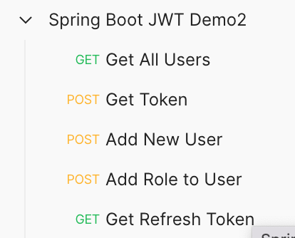
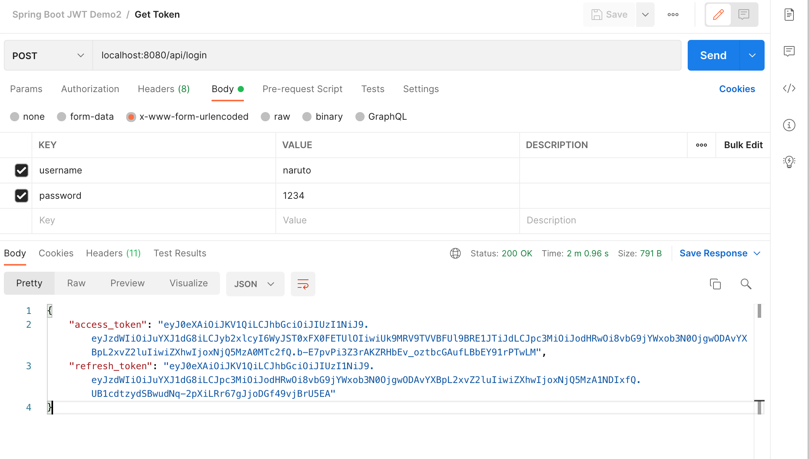
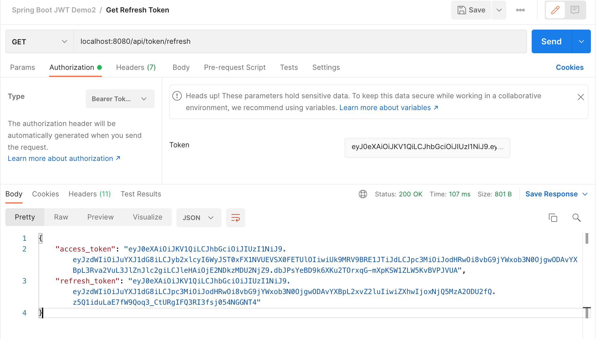
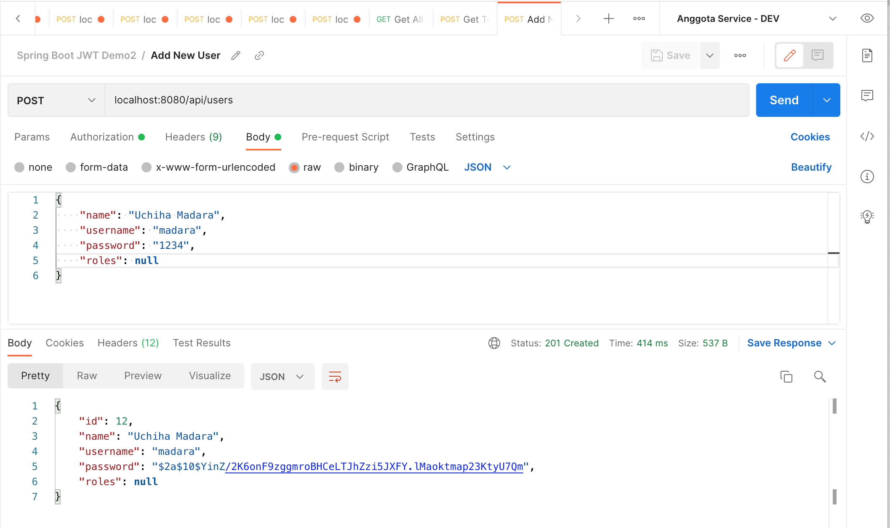
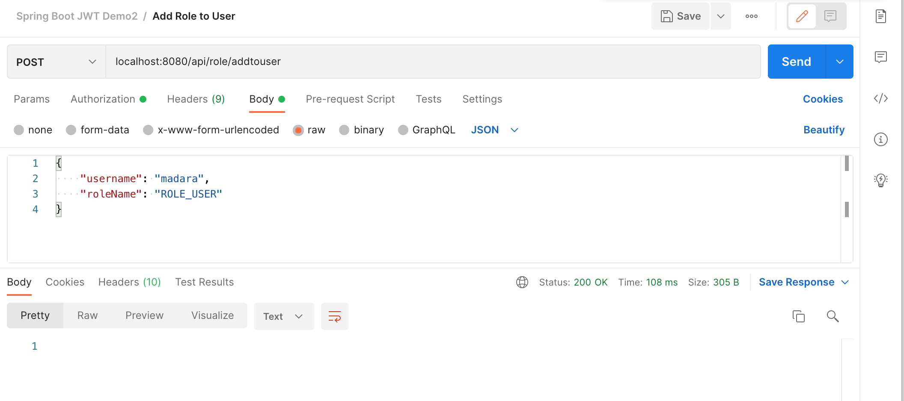
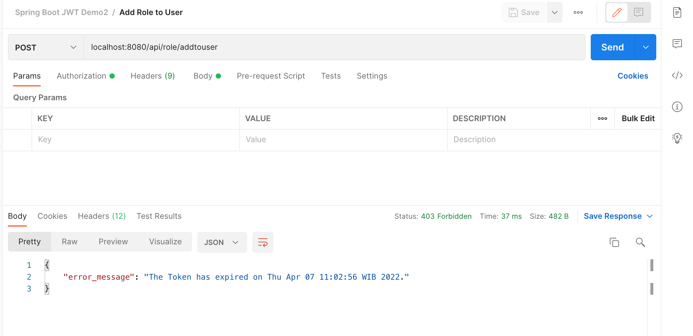

# spring-boot-jwt-demo2

### Things todo list

1. Clone this repository: `git clone https://github.com/hendisantika/spring-boot-jwt-demo2.git`
2. Navigate to the folder: `cd spring-boot-jwt-demo2`
3. Replace MySQL credentials with your own.
4. Run the application: `mvn clean spring-boot:run`
5. Open your POSTMAN APP then import the POSTMAN Collection

### Image Screen shots

All API Request

Get Token

Get Refresh Token

List All Users

Add New User

Add Role to User

Token Expired

